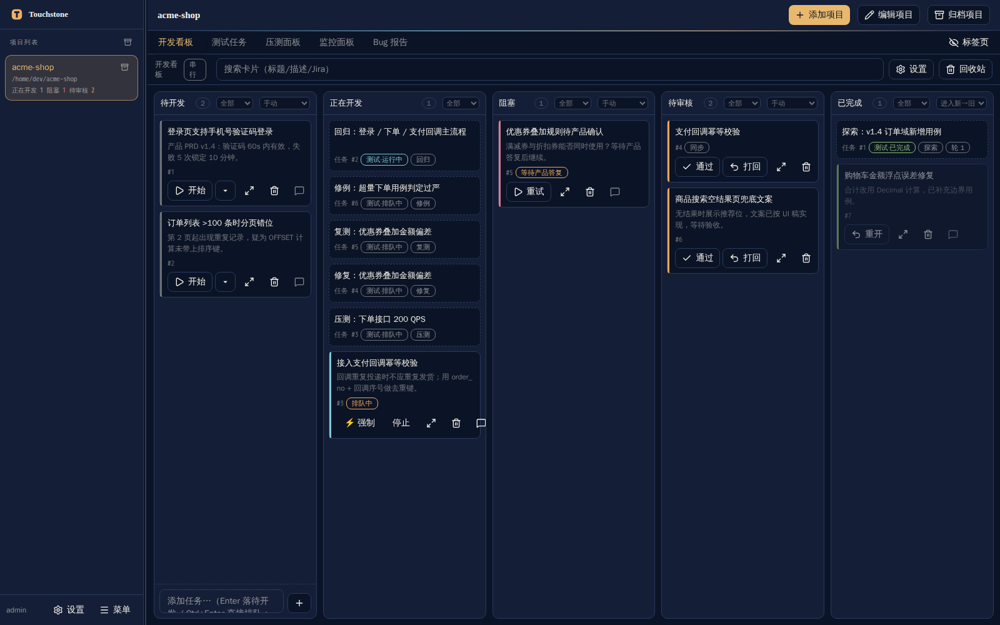
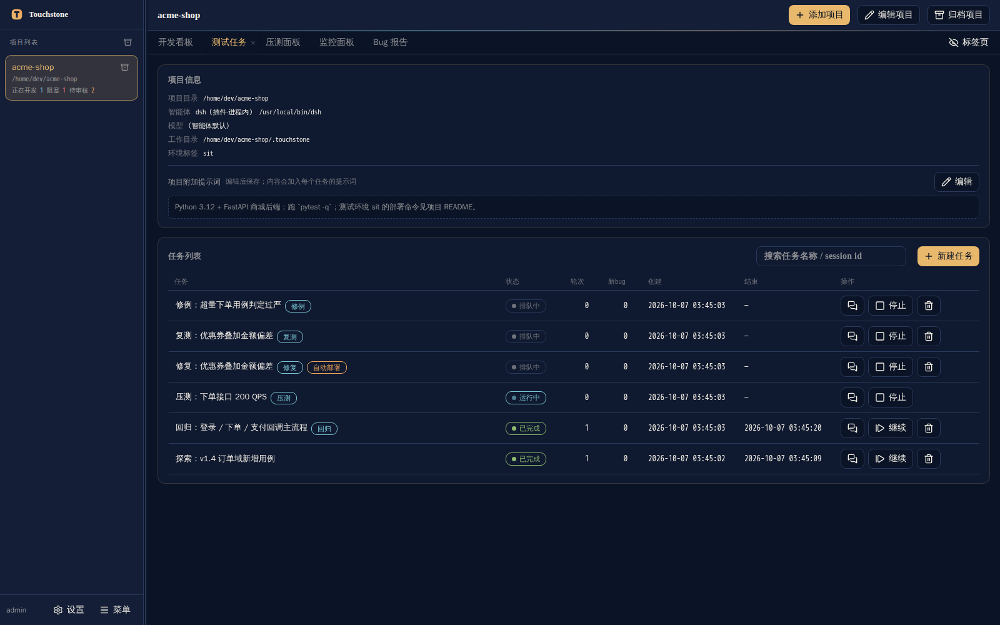
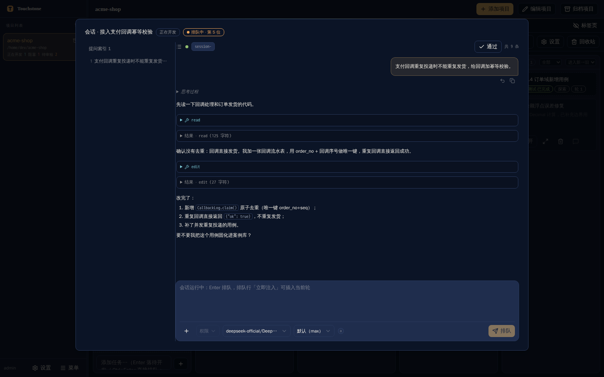
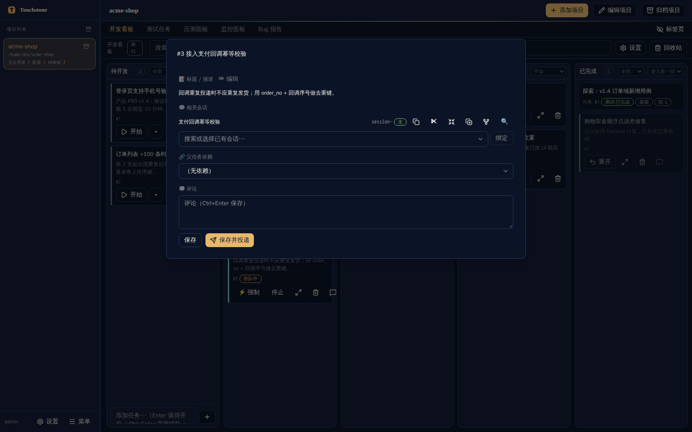
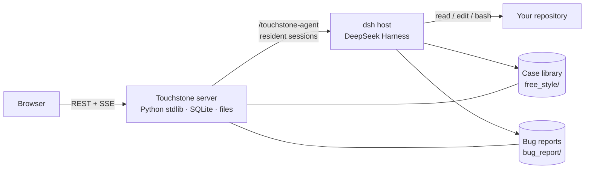

<div align="center">

# Touchstone

**An AI-agent-driven automated testing platform.** Point it at a repository; it explores the code, writes and runs test cases, files what breaks, fixes it, and re-verifies the fix.

[](LICENSE)
[](https://www.python.org/)
[](https://nodejs.org/)
[](https://github.com/deepseek-ai/deepseek-harness)

English | [中文](README.zh.md)



</div>

## What is Touchstone?

Touchstone turns "we really should test more" into a running loop. You register a project — its source
directory, a working directory, an environment label, and the house rules the agent must follow — and
Touchstone drives an AI agent through [DeepSeek Harness](https://github.com/deepseek-ai/deepseek-harness)
(`dsh`) to **generate test cases, execute them, report failures as bug reports, fix the code, and
re-verify the fix**. Every artifact lands on disk in a reviewable form: a case library of Markdown case
files, a `bug_report/` directory, and per-round logs.

It is not a one-shot "run my test suite" CLI. Touchstone is built around **long-lived, multi-round agent
sessions**: a task runs round after round in the same session with its context intact, so the agent
remembers what it already tried. A unified queue keeps exactly one writer per project (no two agents
editing the same checkout at once), and the whole thing is observable — live round logs, a rendered
session window, and an SSE-backed board.

Touchstone runs **locally**. It is a Python web site with a SQLite database and a file-system workspace;
no data leaves your machine except for the model calls your `dsh` host makes.

## Highlights

- **Six task types** covering the whole QA loop — exploration, regression, stress, fix, retest, and case
  revision — each following a seven-stage lifecycle (generate cases → execute → report → analyze → fix →
  deploy → retest).
- **A case library, not a test log.** Cases are human-readable Markdown (`case.md` + `status.md` per
  case, plus an `INDEX.md` per directory). Agents read and extend them across tasks; you can fix a bad
  case by editing a file.
- **Bug reports as first-class artifacts.** Failures are written up as structured reports (severity,
  reproduction steps, log evidence, related cases) and can be routed back into fix / retest / case-revision
  tasks from the UI.
- **Unified per-project queue.** Tasks, board cards, and chat messages all take the same serial slot per
  project; queue position, the current holder, and evidence are queryable rather than guessed.
- **A board for agent-driven development.** Kanban cards start, queue, block, and complete agent sessions;
  cards can run in an isolated `git worktree` so exploratory work never touches your main checkout.
- **Observable sessions.** Render the full transcript of any agent session (messages, reasoning, tool
  calls, results), reply to it, inject into the running turn, compact it, fork it, or rewind to an earlier
  point through a fork.
- **Stress testing built in.** A stress task asks the agent for a scenario + script; the platform then
  drives the load itself, N runs per task, with per-run metrics, charts, and Markdown/JSON reports.
- **Optional integrations.** Feishu (Lark) push notifications with two-way answering from chat cards, and
  RAG-based semantic search over the case library.
- **Self-contained stack.** Backend: Python standard library plus four small dependencies. Frontend: React
  + Vite. Storage: SQLite + plain files. Runs on Linux and Windows.

## Screenshots

The development board — cards per column, task entries inline, per-project queue badges:


Test tasks — six task types, round counts, statuses, and per-task actions:



The session window — the full agent transcript rendered from the `dsh` session store, with reply,
approval, and model controls:



Card detail — description, scheduling, dependent cards, bound sessions, and comments:



## How it works



1. **You create a project.** Touchstone stores the repository path, a work directory, the environment
   label, optional project skills, and free-form guidance that is injected into every first-round prompt.
2. **You create a task.** Pick a type (say, *Exploration*) and an end stage (say, *report*), and Touchstone
   queues it for that project.
3. **Rounds run in a resident agent session.** Touchstone asks the `dsh` plugin to create or resume a
   session and sends the round prompt. Rounds stream back to the UI and to
   `<work_dir>/.web/task_<id>_round_<n>.log` as they happen.
4. **Artifacts land in your work directory.** New cases under `free_style/`, bug reports under
   `bug_report/`, monitoring state under `.live/`. You review them like code.
5. **Follow-up tasks close the loop.** A report can spawn a fix task, a fix can spawn a retest, and a
   rejected report can spawn a case-revision task. When a task's end stage goes past "report", the
   platform appends the downstream stages as a follow-up task automatically.

### Task types

| Type | What the agent does | Typical end stage |
|------|---------------------|-------------------|
| Exploration | Reads the code and writes new test cases into the case library | Report |
| Regression | Re-runs existing cases (optionally limited to a commit date range) | Report |
| Stress | Produces a load scenario + driver script, then the platform runs the load | Report |
| Fix | Analyzes a bug report, patches the code, deploys, and re-tests | Fix / Deploy / Retest |
| Retest | Re-verifies one bug report (retest only, deploy + retest, or deploy only) | Retest |
| Case revision | Rejects a bug report as a bad case and rewrites the case instead | Revision |

### Core concepts

| Concept | Meaning |
|---------|---------|
| Project | A repository plus its work directory, agent binding, environment label, and guidance |
| Task | One queued unit of work: a task type, a stage range, a stop condition, and a round history |
| Round | One prompt/response cycle in the task's agent session |
| Case library | `<work_dir>/free_style/` — Markdown cases, status files, and per-directory indexes |
| Bug report | `<work_dir>/bug_report/<timestamp>_FS_<title>/` — the failure dossier for a case |
| Card | A board item that can start, queue, and drive its own agent session |
| Queue | The per-project serial slot shared by tasks, cards, and chat messages |

## Quick start

### Prerequisites

| Requirement | Version | Needed for |
|-------------|---------|------------|
| Python | 3.12+ | The server (verified on 3.12) |
| Node.js | 22.19+ or 24+ | Running the `dsh` host (the front-end build alone needs Node 18+) |
| DeepSeek Harness (`dsh`) | current release | Agent execution — required for plugin mode |

### 1. Clone and install

```bash
git clone https://github.com/gavinc-cn/touchstone-dsh.git
cd touchstone-dsh
python3 -m pip install -r requirements.txt
```

### 2. Start the site (standalone mode)

```bash
./touchstone.sh start          # builds the front end on first run, then serves 127.0.0.1:4601
./touchstone.sh status         # PID and the actual port
./touchstone.sh stop
```

Then open <http://127.0.0.1:4601>.

The first start seeds an `admin` account. If `TS_ADMIN_PASSWORD` is not set, a random one-time password
is generated and printed **once** in the startup banner:

```bash
grep '一次性初始口令' .run/server.log     # or: ./touchstone.sh status
```

You will be asked to change it on first login. Set `TS_ADMIN_PASSWORD=<your-password>` before the first
start to skip the one-time password (and the forced change).

> Standalone mode gives you the full site — projects, case library, bug reports, board, queue, monitoring —
> but **agent execution needs plugin mode** (below), because the agent runs inside the `dsh` host process.

### 3. Run as a `dsh` plugin (recommended: enables agent execution)

The plugin embeds Touchstone in the `dsh` Web UI as a sidebar entry and panel, and lets Touchstone drive
resident agent sessions in the host process.

```bash
npx @deepseek-ai/dsh web          # 1) start the dsh host once (creates ~/.dsh/profiles/web)
cd touchstone-dsh
./dsh-plugin/install.sh           # 2) idempotent install of the plugin package
# 3) restart the dsh web UI, open http://127.0.0.1:3080, use the Touchstone entry (Alt+T toggles the panel)
```

The installer prints the exact profile patch you need to point the plugin at this checkout:

```yaml
- id: touchstone
  config: { repoDir: /path/to/touchstone-dsh, pythonPath: /path/to/python3 }
```

Both run modes share one database (`~/.touchstone/touchstone.db` by default) and are mutually exclusive
while running; the second instance refuses to start and tells you who holds the lock.

### Windows

A cross-platform launcher offers the same commands:

```bash
python touchstone.py start | stop | restart | status | build | test
```

### First steps in the UI

1. Sign in and open **Settings → Change password** if you used the one-time password.
2. **Add project** — source directory, work directory (defaults to `<project>/.touchstone`), environment
   label, and the guidance the agent should follow. The case library and bug report directories are
   derived and created for you.
3. Create a task (or a board card) and let the queue pick it up. Round logs stream live; the session window
   shows the transcript as it grows.

## Configuration

| Variable | Default | Purpose |
|----------|---------|---------|
| `TS_PORT` / `TS_HOST` | `4601` / `127.0.0.1` | Listen address. Use `TS_HOST=0.0.0.0` to expose the site on your LAN |
| `TS_PYTHON` | `python3` | Interpreter used by the launcher (must have the runtime dependencies) |
| `TOUCHSTONE_DB` | `~/.touchstone/touchstone.db` | SQLite database. Must live on a local disk — file locking does not work on CIFS/network shares |
| `TS_ADMIN_PASSWORD` | *(random, printed once)* | Initial `admin` password; setting it skips the forced change |
| `TS_WEB_DIR` | `webui/dist` | Static front-end directory the server serves |
| `TOUCHSTONE_RUN_DIR` | `.run/` in the repository | PID / log / port files |
| `TS_EXT_DIR` | `extensions` | Root of the built-in asset manifests |
| `TS_ARCHIVE_SYNC` | `1` | Keep board "Done" and `dsh` session archive in sync (set `0` to disable) |
| `TS_DSH_PROFILE` / `TS_DSH_PYTHON` | `web` / auto-detected | `dsh` profile and interpreter used by the plugin installer |

Runtime paths inside a project's work directory:

| Path | Contents |
|------|----------|
| `free_style/` | Case library (cases, status files, indexes) |
| `bug_report/` | Bug reports, one directory per report |
| `.web/` | Round logs, chat logs, stress metrics and reports |
| `.live/live.json` | Agent live state used by the monitoring page |
| `board_media/` | Attachments pasted onto board cards |

## Capabilities and limits

| Area | Supported |
|------|-----------|
| Agent sessions | Create, resume, reply, inject into the running turn, cancel, compact, fork, rewind-by-fork, model and permission-preset switching |
| Session observability | Full transcript rendering, archive state, attachment preview, live status stream (no polling) |
| Tasks | Six types, seven stages, stop conditions, date-range scoping, per-round logs, restart, continue |
| Board | Cards across five columns, drag & drop, queue position, parent dependencies, scheduled start, trash, isolated worktrees |
| Case library | Derived indexes, change-based retest triage, optional semantic (RAG) search |
| Stress testing | Scenario validation, concurrent load, second-by-second metrics, charts, Markdown/JSON reports per run |
| Notifications | Feishu (Lark) outbound push, inbound commands, and answering questions from chat cards |
| Multi-user | Login, admin/user roles, per-project ownership checks on every project-scoped endpoint |

Known limitations, stated plainly:

- **The UI is currently Chinese-only.**
- **Agent execution requires plugin mode**; standalone mode is the site without the agent.
- **Rewind and "compact into a new session" are approximations** — rewind starts a new branch at an
  earlier point (the original session is kept), rather than truncating in place.
- **No error banner for failed model requests** — `dsh` has no event for it, so the session window shows
  what the host reported and nothing more.
- **The Windows launcher is implemented but `dsh` itself has not been verified on Windows yet.**
- **End-to-end test scripts are not distributed** in this repository (see below), so `test-full` and
  `test-ui` report a skip rather than running.

## Repository layout

```
touchstone-dsh/
├── server.py            HTTP site: routing, auth, REST, SSE, static front end
├── runner.py            Task execution engine and per-project scheduling
├── waitq.py             Unified queue model (the single source of truth for "who runs next")
├── board.py             Development board: cards, gates, agent sessions, archive sync
├── chat.py              Session chat: queued messages and injection
├── prompts.py           Per-round prompt templates (per task type, per stage)
├── sessparse.py         Reads the dsh session store into a renderable transcript
├── dshdriver.py         Client for the in-process dsh agent driver
├── dshevents.py         Folds the dsh state stream into an in-process registry
├── rag.py               Optional semantic search over the case library
├── loadgen.py           Built-in stress engine (scenarios, metrics, reports)
├── feishu.py            Feishu (Lark) integration
├── db.py                SQLite data layer
├── builtin_prompts/     Prompt assets injected into first-round prompts
├── dsh-plugin/          The dsh plugin package (thin Node shell + driver + client bundle)
├── extensions/          Built-in assets installable from the settings page
├── webui/               React + Vite front end
├── tests/               pytest / vitest suites and the isolated-instance harness
└── touchstone.sh|py|cmd Launchers (Linux / cross-platform / Windows)
```

## Development

```bash
./touchstone.sh build        # install front-end deps and build webui/dist
./touchstone.sh test         # backend pytest + front-end vitest
./touchstone.sh test-full    # + isolated end-to-end scripts (scripts are not distributed here)
./touchstone.sh test-ui      # Playwright end-to-end (needs a running site; scripts not distributed)
cd webui && npm run dev      # front-end dev server on :5173, /api proxied to :4601
```

Optional commit gate:

```bash
git config core.hooksPath githooks   # pre-commit runs the fast test layer (SKIP_TS_TESTS=1 to skip once)
```

See [tests/README.md](tests/README.md) for the test matrix and prerequisites.

## Security notes

- The site listens on `127.0.0.1` by default and requires a login. Exposing it (`TS_HOST=0.0.0.0`) puts it
  on your network — do that deliberately.
- Every project-scoped endpoint checks ownership before returning data; the `admin` account is the only
  administrator and cannot be renamed or deleted.
- The agent runs with the permission preset you configure. The default is the most permissive one (no
  approval prompts), which is convenient and sharp-edged: **review the project guidance and the preset
  before pointing it at a repository you care about.**
- Passwords are stored with the hashing scheme the project was specified against (unsalted MD5 for new
  passwords, PBKDF2-SHA256 for legacy seed accounts). Treat this as a local-development-grade store.

## License

[MIT](LICENSE) © Touchstone contributors
