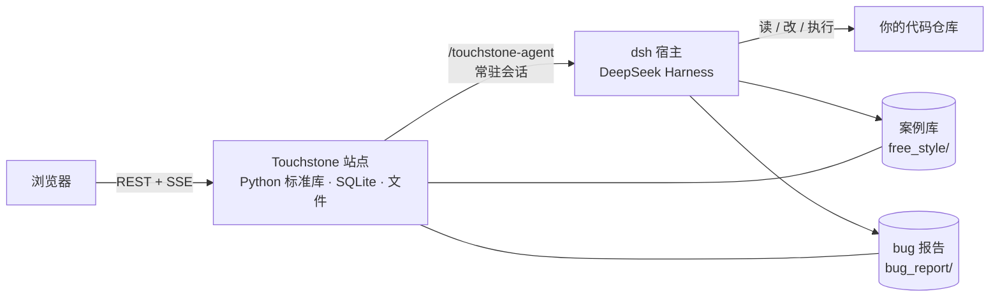

<div align="center">

# Touchstone（试金石）

**AI agent 驱动的自动化测试平台。** 把它指向一个代码仓库，它会读代码、写用例、跑用例，
把失败沉淀成 bug 报告，修完再复测一遍。

[](LICENSE)
[](https://www.npmjs.com/package/@gavinc-cn/touchstone-dsh)
[](https://www.python.org/)
[](https://nodejs.org/)
[](https://github.com/deepseek-ai/deepseek-harness)

[English](README.md) | 中文


</div>

## Touchstone 是什么

Touchstone 把「我们真该多测一点」变成一条持续转动的流水线。你登记一个项目——源码目录、
工作目录、环境标签、以及要求 agent 遵守的项目约定——Touchstone 就会通过
[DeepSeek Harness](https://github.com/deepseek-ai/deepseek-harness)（`dsh`）驱动 AI agent：
**生成测试用例 → 执行 → 把失败写成 bug 报告 → 修代码 → 再复测**。所有产物都以可直接审阅的形式
落在磁盘上：Markdown 写的案例库、`bug_report/` 目录、以及逐轮日志。

它不是「跑一遍我的测试」的一次性 CLI。Touchstone 的核心是**多轮常驻 agent 会话**：一个任务在同一
会话里一轮接一轮地跑，上下文不断档，agent 记得自己试过什么。统一队列保证同一个项目同一时刻只有
一个写者（不会有两个 agent 同时改同一份检出），并且全流程可观测——逐轮实时日志、可渲染的会话窗口、
以及基于 SSE 的看板。

Touchstone 是**本地运行**的：Python 站点 + SQLite + 文件系统工作区。除了你的 `dsh` 宿主发起的模型
调用之外，数据不出本机。

## 主要特性

- **六类任务**覆盖完整测试闭环：探索 / 回归 / 压测 / 修复 / 复测 / 修例，每类都走七阶段生命周期
  （生成用例 → 测试 → 生成报告 → 报告分析 → 问题修复 → 重新部署 → 复测）。
- **案例库而不是测试日志**。用例是可读的 Markdown（每个用例 `case.md` + `status.md`，每层目录一个
  `INDEX.md`）。agent 跨任务读写同一份案例库；用例写错了，你直接改文件就能修。
- **bug 报告是一等产物**。失败会写成结构化报告（严重程度、复现步骤、日志证据、关联用例），并可在
  界面上直接派生成修复 / 复测 / 修例任务。
- **按项目的统一队列**。任务、看板卡片、会话消息共用同一个项目级串行位；排队位次、当前占用者与
  判定证据都可查，不靠猜。
- **面向 agent 开发的看板**。卡片可以起跑、排队、阻塞、完成各自的 agent 会话；需要时在独立的
  `git worktree` 里跑，探索性改动不碰你的主检出。
- **会话可观测**。完整渲染任意 agent 会话的消息、思考、工具调用与返回；可续聊、可往当前轮注入、
  可压缩、可 fork、也可通过 fork 回退到更早的节点。
- **内置压测**。压测任务先让 agent 产出场景与脚本，之后由平台自己发压，一个任务可跑 N 次，每次都有
  指标、图表与 Markdown/JSON 报告。
- **可选集成**。飞书（Lark）推送通知与卡片双向作答；案例库的可选语义检索（RAG）。
- **自包含技术栈**。后端：Python 标准库 + 4 个小依赖；前端：React + Vite；存储：SQLite + 普通文件。
  Linux 与 Windows 均可运行。

## 界面截图

开发看板——五列卡片、任务条目内联展示、项目级排队徽标：


测试任务——六类任务、轮次、状态与逐任务操作：


会话窗口——从 `dsh` 会话存储渲染出的完整对话（消息、思考、工具调用），带回复、审批与模型控件：


卡片详情——描述、定时开工、父任务依赖、绑定会话与评论：


## 工作原理



1. **建项目**：Touchstone 记录仓库路径、工作目录、环境标签、可选的项目能力 skill，以及每轮首轮
   提示词都会注入的自由文本约定。
2. **建任务**：选类型（例如「探索」）与终点阶段（例如「生成报告」），入该项目的队列。
3. **多轮会话执行**：Touchstone 经 `dsh` 插件新建或续接一个常驻会话，下发本轮提示词；过程实时回流
   到界面，并写入 `<工作目录>/.web/task_<id>_round_<n>.log`。
4. **产物落到工作目录**：新用例进 `free_style/`，bug 报告进 `bug_report/`，监控状态进 `.live/`——
   你像审代码一样审它们。
5. **后段任务闭环**：报告可派生修复任务，修复可派生复测任务，被否决的报告可派生修例任务；当任务的
   终点越过「生成报告」时，平台会自动追加后段阶段任务。

### 任务类型

| 类型 | agent 做什么 | 常见终点 |
|------|--------------|----------|
| 探索 | 读代码并把新用例写进案例库 | 生成报告 |
| 回归 | 重跑已有用例（可限定提交日期范围） | 生成报告 |
| 压测 | 产出压测场景 + 驱动脚本，随后由平台发压 | 生成报告 |
| 修复 | 分析 bug 报告、改代码、部署并复测 | 问题修复 / 重新部署 / 复测 |
| 复测 | 针对一份 bug 报告复验（仅复测 / 部署后复测 / 仅部署） | 复测 |
| 修例 | 判定报告对应的用例本身有误，改写用例 | 修订用例 |

### 核心概念

| 概念 | 含义 |
|------|------|
| 项目 | 一个仓库 + 工作目录 + 智能体绑定 + 环境标签 + 项目约定 |
| 任务 | 一个排队单元：任务类型、阶段范围、停止条件与轮次历史 |
| 轮次 | 任务会话里的一次「提示词 → agent 执行」循环 |
| 案例库 | `<工作目录>/free_style/`：Markdown 用例、状态文件与逐层索引 |
| bug 报告 | `<工作目录>/bug_report/<时间戳>_FS_<标题>/`：一条用例的失败档案 |
| 卡片 | 看板条目，可起跑、排队并驱动自己的 agent 会话 |
| 队列 | 任务 / 卡片 / 会话消息共享的项目级串行位 |

## 快速开始

### 环境要求

| 依赖 | 版本 | 用途 |
|------|------|------|
| Python | 3.12+ | 运行站点（实测 3.12） |
| Node.js | 22.19+ 或 24+ | 运行 `dsh` 宿主（仅构建前端时 Node 18+ 即可） |
| DeepSeek Harness（`dsh`） | 当前版本 | agent 执行——插件形态必需 |

### 1. 克隆并安装

```bash
git clone https://github.com/gavinc-cn/touchstone-dsh.git
cd touchstone-dsh
python3 -m pip install -r requirements.txt
```

### 2. 启动站点（独立形态）

```bash
./touchstone.sh start          # 首次启动会自动构建前端，然后监听 127.0.0.1:4601
./touchstone.sh status         # 查看 PID 与实际端口
./touchstone.sh stop
```

浏览器打开 <http://127.0.0.1:4601>。

首次启动会种子一个 `admin` 账号。若未设置 `TS_ADMIN_PASSWORD`，平台会随机生成一次性初始口令，
**只在启动横幅打印一次**：

```bash
grep '一次性初始口令' .run/server.log     # 或：./touchstone.sh status
```

首次登录会被要求改密。想跳过一次性口令（以及强制改密），在首次启动前设置
`TS_ADMIN_PASSWORD=<你的口令>` 即可。

> 独立形态给的是完整站点——项目、案例库、bug 报告、看板、队列、监控都能用；但**agent 执行需要
> 插件形态**（见下），因为 agent 跑在 `dsh` 宿主进程里。

### 3. 以 `dsh` 插件形态运行（推荐：启用 agent 执行）

插件把 Touchstone 嵌进 `dsh` Web 界面（侧栏入口 + 面板），并让 Touchstone 能驱动宿主进程内的常驻
agent 会话。

**方式 A —— 从 npm 安装（自包含包：整个平台 + 预构建前端都在包里）:**

```bash
npx @deepseek-ai/dsh web          # 1) 先启动一次 dsh 宿主（会创建 ~/.dsh/profiles/web）
dsh plugin --profile web add @gavinc-cn/touchstone-dsh   # 2) 装插件包
# 3) 把包名选进 profile 清单（等同 Plugins 面板里那一行的开关）：
node ~/.dsh/profiles/web/node_modules/@gavinc-cn/touchstone-dsh/dsh-plugin/scripts/select-bundle.mjs \
  ~/.dsh/profiles/web/package.json
# 4) 重启 dsh web，打开 http://127.0.0.1:3080，用侧栏里的 Touchstone 入口（Alt+T 开关面板）
```

平台自身的 Python 依赖走 pip，npm 不管：

```bash
pip install -r ~/.dsh/profiles/web/node_modules/@gavinc-cn/touchstone-dsh/requirements.txt
# Windows 用 python -m pip install ...（官方安装器只装 python.exe，没有 python3）
```

解释器不用配也行：插件自己探——先试 `python`、再试 `python3`（与 `touchstone.cmd` 同序），
用第一个真能跑起来的那个。如果探到的不是你装依赖的那支，缺依赖提示页里给的就是**它探到的那支**
的解释器命令；想指定别支，在 profile patch 里写 `pythonPath`：

```yaml
- id: touchstone-dsh
  config: { pythonPath: /path/to/python }
```

**不需要配 `repoDir`**：包里带着 `server.py` 与 `webui/dist-plugin`，插件缺省就用包自身目录。

**方式 B —— 从检出安装（开发用）:**

```bash
cd touchstone-dsh
./dsh-plugin/install.sh           # 幂等安装本检出到 profile
```

安装脚本会打印**可选**的 profile 覆盖（指向本机工作副本、或指定解释器）；不写就用包自身目录：

```yaml
- id: touchstone-dsh
  config: { repoDir: /path/to/touchstone-dsh, pythonPath: /path/to/python3 }
```

两种形态默认共用同一个数据库（`~/.touchstone/touchstone.db`），运行时互斥：第二个实例会拒绝启动，
并打印当前占用者。

### Windows

跨平台启停器提供同一套命令：

```bash
python touchstone.py start | stop | restart | status | build | test
```

### 界面里的第一步

1. 登录；若用的是一次性口令，先去 **设置 → 修改密码**。
2. **添加项目**——源码目录、工作目录（默认 `<项目目录>/.touchstone`）、环境标签，以及要求 agent
   遵守的约定。案例库与 bug 报告目录由平台派生并自动创建。
3. 新建任务（或建一张看板卡），等队列调度。逐轮日志实时刷新，会话窗口随对话增长即时渲染。

## 配置

| 环境变量 | 默认值 | 作用 |
|----------|--------|------|
| `TS_PORT` / `TS_HOST` | `4601` / `127.0.0.1` | 监听地址；`TS_HOST=0.0.0.0` 可对局域网开放 |
| `TS_PYTHON` | `python3` | 启停器使用的解释器（需装好运行依赖） |
| `TOUCHSTONE_DB` | `~/.touchstone/touchstone.db` | SQLite 数据库，必须放本地盘——文件锁在 CIFS/网盘上不可用 |
| `TS_ADMIN_PASSWORD` | *（随机，打印一次）* | `admin` 初始口令；设了就跳过强制改密 |
| `TS_WEB_DIR` | `webui/dist` | 站点托管的前端静态目录 |
| `TOUCHSTONE_RUN_DIR` | 仓库内 `.run/` | PID / 日志 / 端口标记文件目录 |
| `TS_EXT_DIR` | `extensions` | 内置资产清单根目录 |
| `TS_ARCHIVE_SYNC` | `1` | 看板「已完成」与 `dsh` 会话归档双向同步（置 `0` 关闭） |
| `TS_DSH_PROFILE` / `TS_DSH_PYTHON` | `web` / 自动探测 | 插件安装脚本使用的 `dsh` profile 与解释器 |

项目工作目录下的运行路径：

| 路径 | 内容 |
|------|------|
| `free_style/` | 案例库（用例、状态文件、逐层索引） |
| `bug_report/` | bug 报告，一份报告一个目录 |
| `.web/` | 逐轮日志、对话日志、压测指标与报告 |
| `.live/live.json` | 监控页数据源（agent 运行状态） |
| `board_media/` | 粘贴到看板卡片的附件 |

## 能力与边界

| 领域 | 支持情况 |
|------|----------|
| agent 会话 | 新建、续接、回复、往当前轮注入、中断、compact 压缩、fork、按 fork 回退、模型与权限档切换 |
| 会话可观测 | 完整对话渲染、归档状态、附件预览、实时状态流（零状态轮询） |
| 任务 | 六类型、七阶段、停止条件、日期范围限定、逐轮日志、重启、继续 |
| 看板 | 五列卡片、拖拽、排队位次、父任务依赖、定时开工、回收站、独立 worktree |
| 案例库 | 派生索引、按变更文件做复测粗筛、可选语义检索（RAG） |
| 压测 | 场景校验、并发发压、秒级指标、图表、每次运行独立的 Markdown/JSON 报告 |
| 通知 | 飞书推送、入站指令、在聊天卡片上直接作答 |
| 多用户 | 登录、admin/普通用户、所有按项目进入的接口都做归属校验 |

如实说明的已知限制：

- **界面目前只有中文。**
- **agent 执行必须走插件形态**；独立形态是「没有 agent 的站点」。
- **回退与「压缩并新建」是语义近似**——回退是从更早的节点另起一支（原会话保留），不是原地截断。
- **模型请求失败没有错误横幅**——`dsh` 没有对应事件通道，会话窗只能显示宿主真实回报的内容。
- **Windows 启停器已实现，但 `dsh` 在 Windows 上尚未实机验证。**
- **端到端测试脚本不随本仓分发**（见下），因此 `test-full` 与 `test-ui` 只会提示跳过。

## 仓库结构

```
touchstone-dsh/
├── server.py            HTTP 站点：路由、鉴权、REST、SSE、静态前端
├── runner.py            任务执行引擎与按项目调度
├── waitq.py             统一队列模型（「下一个谁跑」的唯一权威）
├── board.py             开发看板：卡片、门禁、agent 会话、归档同步
├── chat.py              会话对话：排队消息与注入
├── prompts.py           逐轮提示词模板（按任务类型与阶段）
├── sessparse.py         读取 dsh 会话存储，还原成可渲染的对话
├── dshdriver.py         dsh 进程内 agent 驱动的客户端
├── dshevents.py         把 dsh 状态流折进进程内注册表
├── rag.py               案例库可选语义检索
├── loadgen.py           内置压测引擎（场景、指标、报告）
├── feishu.py            飞书集成
├── db.py                SQLite 数据层
├── builtin_prompts/     注入首轮提示词的提示词资产
├── dsh-plugin/          dsh 插件包（Node 薄壳 + 驱动 + 客户端 bundle）
├── extensions/          设置页可一键安装的内置资产
├── webui/               React + Vite 前端
├── tests/               pytest / vitest 套件与隔离实例夹具
└── touchstone.sh|py|cmd 启停入口（Linux / 跨平台 / Windows）
```

## 开发

```bash
./touchstone.sh build        # 安装前端依赖并构建 webui/dist
./touchstone.sh test         # 后端 pytest + 前端 vitest
./touchstone.sh test-full    # 追加隔离实例 e2e（本仓不随附这些脚本）
./touchstone.sh test-ui      # Playwright e2e（需站点在跑；本仓不随附这些脚本）
cd webui && npm run dev      # 前端开发服务器 :5173，/api 代理到 :4601
```

可选的提交门禁：

```bash
git config core.hooksPath githooks   # pre-commit 跑测试快层（SKIP_TS_TESTS=1 单次跳过）
```

测试矩阵与前置条件见 [tests/README.md](tests/README.md)。

## 安全说明

- 站点默认只监听 `127.0.0.1` 并要求登录。用 `TS_HOST=0.0.0.0` 对外暴露等于把它放进你的网络里，
  请有意为之。
- 所有按项目进入的接口先做归属校验；`admin` 是唯一管理员，不可改名或删除。
- agent 以你配置的权限档运行，默认是限制最松的一档（免审批）。方便，但也锋利：**把它指向你在意的
  仓库之前，请先看清项目约定与权限档。**
- 口令存储沿用本项目既定的算法（新口令为无盐 MD5，历史种子账号为 PBKDF2-SHA256）。请把它当作
  本地开发级别的口令存储来对待。

## 许可证

[MIT](LICENSE) © Touchstone contributors
