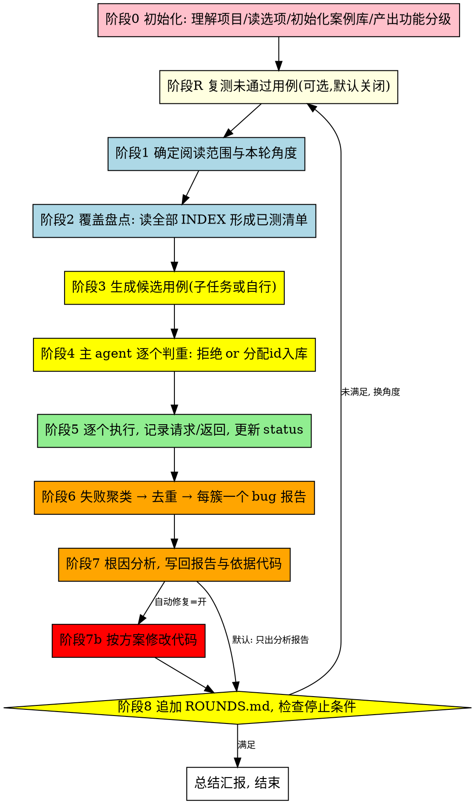

# 自由风格探索性测试（Free Style Test）流程

> 本文档是 Touchstone 平台内置的测试流程提示词，由平台在任务首轮 prompt 中注入，
> 不依赖任何外部 skill 或配置文件。案例库根目录、bug 报告目录、阅读范围、选项、
> 停止条件、环境标签均以平台约束块（本文之前「约束如下」部分）注入的实际值为准。

## 概述

本流程是一个**多轮自主测试循环**：（可选：每轮开始先复测未通过用例）理解项目 → 生成去重用例 → 逐个执行并记录 → 失败聚类出 bug 报告 → 分析根因 →（可选：自动修复）→ 判断停止条件 → 换角度进入下一轮。

本流程自主决定测什么，目标是在**未被覆盖的场景**里发现**新 bug**。测什么、先测什么受根 INDEX.md「功能分级」节制导：**先测核心功能（P0），再逐步扩展到细枝末节（P2）**，顺序规则见「功能分级与测试顺序」一节。

案例库位于平台指定的案例库根目录，跨轮次、跨会话持续积累；判重以案例库内容为准，不靠记忆。

## 功能分级与测试顺序

case 生成顺序受**功能分级**控制：先测核心功能，再逐步扩展到细枝末节，避免核心主流程尚未覆盖时就陷入边界/异常类细节。

| 等级 | 含义 |
|------|------|
| **P0 核心功能** | 系统存在的根本目的，主流程走不通则系统不可用的功能（如登录、核心业务主流程） |
| **P1 重要功能** | 常用辅助/管理功能（如配置管理、列表检索、导出） |
| **P2 细节边缘** | 边界值、异常时序、罕见字段组合、权限边缘等细枝末节场景 |

- **分级清单**：阶段 0 理解项目时产出，落盘到根 INDEX.md「功能分级」节（格式见附带 INDEX 模板）；项目附加提示词中有核心功能说明时以其为准、agent 只补充完善，否则由 agent 自行分析得出。跨任务（新会话）直接读已有清单，仅在认识变化时修订
- **覆盖状态**：取值 `未覆盖 / 已覆盖`——该功能域已有入库用例且执行过（含失败已出报告）即算「已覆盖」；覆盖指「测过」，不含「通过」。轮次收尾（阶段 8）统一回写
- **顺序规则**（阶段 1 执行）：从「最高优先级中存在未覆盖功能域」的层级出发选角度，该层级功能域全部覆盖后才降级到下一层；高优先级功能域未覆盖时，禁止选择仅服务细节场景的角度（边界值、异常时序、字段组合等），角度在选定功能域内按「主流程 → 变体 → 异常 → 边界」渐进
- **进度上报**：分级产出与覆盖状态变化时，同步写 live.json 的 `priorities` 字段（格式见「运行状态文件 live.json」一节），供监控页展示测试进度

## 目录与文件约定

```
<案例库根目录>/
├── INDEX.md                      # 根索引：功能分级、分类树、id 游标、总体统计
├── ROUNDS.md                     # 轮次历史：完整角度清单 + 最近轮次详情（旧轮次详情移入 ROUNDS_archive.md）
├── <模块>/                       # 一级分类，按被测项目的模块/功能划分
│   ├── INDEX.md                  # 本层索引：直属子目录与 case 一览
│   └── <功能>/                   # 二级分类，允许继续嵌套
│       ├── INDEX.md
│       └── FS0001_用例名称/      # 用例文件夹：id_用例名称
│           ├── case.md           # 用例定义（唯一权威，格式见附带模板）
│           ├── status.md         # 当前状态 + 最近结果 + 失败原因（附带模板）
│           └── execution_%Y%m%d_%H%M.md  # 每次执行的完整请求/返回记录
```

规则：

1. **id 全局唯一**，格式 `FS%04d`（FS0001、FS0002…）。**只有主 agent 能分配 id**：根 INDEX.md 维护 `下一个可用 id`，接受用例时取号并立刻更新游标。生成步骤产出的提案**不带正式 id**。
2. **每层目录必须有 INDEX.md**（格式见附带模板），记录直接子项：子目录一句话说明；case 的 id/名称/一句话测试点/状态/关联 bug 报告。根 INDEX.md 额外维护功能分级、id 游标与统计。
3. **case.md 是用例唯一权威**，字段见附带模板（接口/分类/测试目标/测试方法/输入参数/预期输出/输出获取方式/验证逻辑/备注）。
4. **status.md 状态取值**：`未执行` / `通过` / `失败` / `跳过` / `需要复测`（复测流程中由主 agent 标记）。失败必须写失败原因与关联 bug 报告；通过/失败都要在 execution 文件中记录完整请求与返回。
5. 用例需要的脚本、数据文件直接放用例文件夹内。
6. **`.live/` 是平台维护的机器产物目录**（派生索引 `cases.jsonl` / `similar.jsonl` / `rag_index.jsonl`，随时可重建）：agent 只读不写，判重扩展用法见阶段 4。

## 停止条件

以平台约束块注入的停止条件为准（如「只执行这一轮」）；约束块未给轮数/bug 阈值/时限时，执行完一轮即结束。

**内置保护**（无需指定）：一整轮 0 个新用例入库且 0 个新 bug → 停止并在摘要中说明"已找不到新角度"。

**计数口径**：只算**新建 bug 报告**（按根因聚类去重后）。失败命中已有 bug 报告（含历史）时只追加证据，不计数。

## 自动修复选项

由平台约束块给定（`自动修复=开/关`），**默认关闭**。

| 模式 | 行为 |
|------|------|
| **关闭（默认）** | 只出分析报告：分析方定位根因、给出修复方案并写入 bug_report.md，状态"已分析，待修复"。不修改任何业务代码。 |
| 开启 | 分析报告之后进入阶段 7b：按方案修改源码（支持子任务时派修复子任务，否则主 agent 自行修改），修复记录写回 bug_report.md。 |

开启时的约束（修复方必须遵守）：

- 遵守项目红线：**不编译、不部署、不 git 提交**；最小修改，代码风格与已有代码一致
- 修复方案不明确或改动风险大（涉及公共数据结构/通信协议/持久化格式）时，**不修改**，只在 bug_report.md 中记录原因
- 改动未经构建部署时对运行中的服务不生效，因此**本轮不重跑用例验证修复**；验证留待后续构建部署后进行
- 状态字段改为"已修复（未验证）"，并在 bug_report.md 增加"修复记录"节：修改文件:行号 + 修改摘要

## 复测选项

由平台约束块给定（`复测=开/关`），**默认关闭**。开启后，每轮开始先执行阶段 R（复测）再生成新用例，复测范围为案例库中所有状态为 `失败` 的用例。

复测失败**不计入**停止条件的新 bug 计数（已知问题的延续，不是新发现）。详细流程见阶段 R。

## 运行状态文件 live.json

运行期间**始终维护** `<工作目录>/.live/live.json`（即项目设置的工作目录下 `.live/`；案例库根目录内不放运行状态文件。平台监控页读取它展示测试进度；监控页未打开时它只是落盘状态，无副作用）：

- **写入时机**：运行开始、每次阶段切换、每条用例开始/结束、每批提案判重完成、每个 bug 报告新建/追加、功能分级产出或覆盖状态变化、每轮结束。事件产生时**立即写**，不攒批
- **写入方式**：先写工作目录 `.live/live.json.tmp` 再 `mv` 覆盖，避免读到半文件
- **events 上限 200 条**，超出丢弃最旧
- 运行结束写 `phase: "done"` 并保留最终统计

字段约定（缺省字段监控页自动降级显示）：

| 字段 | 说明 |
|------|------|
| `updated_at` / `run_started_at` | `%Y-%m-%d %H:%M:%S`；后者用于"已运行时长" |
| `round` / `phase` / `phase_label` | 当前轮次；phase 取值 `idle/retest/angle/scan/generate/review/execute/cluster/analyze/fix/wrapup/done`，驱动阶段步进器 |
| `stop_condition` | `{label, new_bugs, target_bugs}` |
| `options` | `{auto_fix, retest}` |
| `current_case` | `{id, name, relpath}`；监控页用例树中对应行高亮 |
| `stats` | `{proposed, accepted, rejected, executed, passed, failed, skipped, new_bug_reports, fixed}` |
| `priorities` | 功能分级测试进度 `{levels: [{level, label, domains: [{name, status}]}]}`；`status` 取值 `未覆盖/已覆盖`，与根 INDEX.md「功能分级」节一一对应；分级产出与覆盖状态变化时立即写 |
| `events` | 事件数组 `[{ts, type, message, case_id?, request?, response?}]`；type 取值 `round_start/phase/proposal/reject/case_start/case_pass/case_fail/case_skip/bug_new/bug_append/analyze_done/fix_done/note`；`case_pass`/`case_fail` 必须带 `request`/`response` |
| `bugs` | 本轮 bug 报告列表 `[{dir, title, status, cases[]}]`，`dir` 为 bug 报告目录下的目录名 |

## 主流程



### 阶段 0：初始化（每次任务只做一次）

1. **理解项目**：优先使用平台约束块注入的「项目上下文/项目附加提示」；未提供或信息不够时，自行探索项目目录补齐——读 README/AGENTS.md 等文档、目录结构、构建文件（package.json/CMakeLists.txt/pom.xml 等）、配置文件与入口代码，弄清三件事：被测系统是什么、如何调用它（HTTP 接口/CLI 命令/脚本/库函数）、如何观察结果（返回值/日志/数据库/消息推送）。部署方式同理：有文档以文档为准，没有则从构建/启动脚本推断，并在本轮摘要中注明不确定项。
2. 从平台约束块读取选项（自动修复、复测）与停止条件，记录开始时间。
3. 案例库根目录不存在则创建，并初始化根 INDEX.md（id 游标从 FS0001 起）与 ROUNDS.md（角度覆盖表格式见下文「ROUNDS.md 格式」）。
4. **功能分级**：按「功能分级与测试顺序」一节产出分级清单，写入根 INDEX.md「功能分级」节；旧案例库无此节时本轮补建，已有则核对修订（认识变化时才改）。
5. 写 live.json 初始状态（phase 从 idle 进入首轮 phase；含 `priorities` 功能分级进度，格式见「运行状态文件 live.json」字段表）。

### 阶段 R：复测未通过用例（每轮开始；默认关闭）

前提：约束块 `复测=开`。每轮开始（生成新用例之前）执行：

1. **盘点**：扫各级 INDEX.md 与 status.md，找出状态为 `失败` 的用例。
2. **判断是否需要复测**（主 agent 判断），剔除：
   - 关联 bug 报告状态为"已修复（未验证）"且改动尚未构建部署生效的——复测必然复发，跳过并注明
   - 失败原因已确认为环境/设计行为且环境未变化的
3. **脚本优先**：待复测用例目录内已有 `verify.py` 的，直接执行 `python3 verify.py`（退出码 0=通过、1=断言不符、2=环境问题），完整记录输出到 execution 文件；退出码 1 时先人工复核脚本断言是否过期（接口/数据变化），过期则修正脚本后重跑并在记录中注明，确认真回归才按失败处理。
4. **标记**：需要复测的用例先把 status.md 状态改为 `需要复测`，同步所属 INDEX.md。
5. **复测**：按阶段 5 的执行纪律逐条执行，记录新的 execution 文件。
6. **结果处理**：
   - 通过 → status.md 改 `通过` 并同步 INDEX.md；在关联 bug 报告追加复测通过记录（时间/环境/完整请求/返回），报告状态字段标注"复测通过"
   - 未通过 → 关联 bug 报告还在（bug 报告目录下存在）→ 把新证据（复测时间、完整请求/返回、case id）追加到报告的「复测证据」节；报告已不存在（已归档/被删）→ 按阶段 6 规则查重新建，标注"复发"。**复测失败不计入新 bug 计数**

### 阶段 1：阅读范围与本轮角度

- 约束块给了 **commit** → 用 git 命令（`git show --stat`、`git diff <commit>^ <commit>` 等）取该 commit 的变更文件列表与 diff，作为阅读范围。
- 给了**模块/目录** → 以该模块源码为范围。
- 未指定 → 全项目，但必须为本轮选定一个**具体角度**（见下）。

**角度选择**：先读根 INDEX.md「功能分级」节（缺失则按阶段 0 规则补建），从「最高优先级中存在未覆盖功能域」的层级出发，选定本轮主攻的功能域；再结合 ROUNDS.md 中历次角度，在该功能域内按「主流程 → 变体 → 异常 → 边界」渐进，选一个没测过的具体角度。高优先级功能域未覆盖时，禁止选择仅服务细节场景的角度（边界值、异常时序、字段组合等）。

角度示例（按层级排列）：

- 主流程（P0/P1）：核心功能正常路径、跨模块主链路、推送与持久化一致性
- 变体与组合（P1/P2）：字段组合约束、配置变化时的行为、非工作状态/权限不足时的行为
- 细节边缘（P2）：接口边界值（0/负数/超长/极值）、异常时序（重复提交、并发、撤回已完成操作）、配置缺失/非法时的行为

每轮一个主角度，禁止重复 ROUNDS.md 已记录的角度；记入 ROUNDS.md 时角度带优先级标签（如 `[P0] 下单主流程`）。

### 阶段 2：覆盖盘点（判重的依据）

1. 读根 INDEX.md 全文（含「功能分级」节，顺带统计各优先级 未覆盖/已覆盖 功能域数，供本轮生成范围取舍与轮末覆盖回写）；对**本轮范围相关的模块**读其各级 INDEX.md 明细，形成"已测场景清单"。非相关模块只取根 INDEX 的一句话分类说明，不展开读（用例数增多后全量读会挤占上下文）。
2. 索引信息不足时，抽读相关 case.md 的**测试目标**与**输入参数**段落确认。
3. 案例库根目录若存在 `.live/cases.jsonl`（平台索引导出工具生成的派生索引），优先用它按接口/关键词过滤查找，代替逐目录翻 INDEX。
4. 清单作为生成步骤的输入和主 agent 判重的依据。

### 阶段 3：生成候选用例

若当前环境支持派发子任务（subagent/task 类工具），派发一个生成子任务完成；否则主 agent 按相同要求自行生成。生成方零上下文，输入必须包含：

- 项目根路径、本轮阅读范围（commit diff 文件列表 / 模块路径 / 全项目+角度）
- 阶段 2 的已测场景清单（**只贴本轮范围相关模块的明细**；非相关模块只给根 INDEX 的一句话分类说明——跨模块判重由主 agent 在阶段 4 负责，不指望生成方持有全量清单）
- 用例设计原则：正常/异常/边界全覆盖；用例可被 AI 直接执行（步骤可操作、输入具体）；判断标准明确；**以当前代码为准**（「依据代码」字段必填 文件:行号，禁止凭想象写接口）；字段格式见附带 case 模板
- 输出要求：**纯提案**，每个候选含 用例名称、建议分类路径（模块/功能）、case.md 全部字段（**依据代码必填**）；**不带正式 id、不写任何文件**
- 数量建议每轮 10~20 条，必须贴本轮角度及其所属功能域/优先级，禁止提案已测清单中的场景；高优先级功能域轮次禁止夹带细枝末节类提案（如超长入参、并发时序类用例）

### 阶段 4：主 agent 判重入库

对每条候选用例：

1. **判重**：与已测场景清单比对测试目标与输入参数；疑似重复时读已有 case.md 确认；疑似与**非本轮范围**模块重复时，按接口名+关键词搜索（或查 `.live/cases.jsonl`）目标模块确认，不预先全量读入。关键词命中后，再查 `.live/similar.jsonl` 取该用例的 similar 近邻扩展比对（近邻中疑似重复的读其 case.md 确认）；本角度关键词无命中时，也可用本轮角度关键词直接 grep `similar.jsonl` 的 name 字段扩展排查。该文件不存在（RAG 未启用）时跳过这一步，仅按关键词。测相同功能/同一场景的 → **拒绝**（可要求补一条替代的，或直接丢弃）。
2. **入库**：通过则分配 id（取根 INDEX.md 游标并 +1）、确定分类路径（必要时新建分类目录与各层 INDEX.md）、写 case.md 与 status.md（初始 `未执行`）、在所属各层 INDEX.md 登记。

### 阶段 5：执行与记录

执行纪律：

1. 严格按 case.md 的测试方法与输入参数执行，不临场改参数；确实需要变化时先回写用例再执行。
2. 逐个执行入库用例，**完整记录请求与返回**到 `execution_%Y%m%d_%H%M.md`（通过/失败都要记）；超长输出截断保留头部与关键错误段，并注明"已截断"。
3. **负向测试判定**：被测系统按预期返回错误码/错误信息 = 用例通过；进程崩溃、服务无响应、数据损坏 = 失败。
4. **不可逆副作用操作**（删除数据、资金/状态变更、外发消息等）在当前环境不可恢复时标 `跳过` 并写明原因；目标系统不可达/依赖未就绪时先重试，确认环境问题后标 `跳过` 并说明原因（环境问题不是 bug）。
5. 更新 status.md：`通过` 或 `失败`（失败写明原因摘要）或 `跳过`，并登记 execution 文件名；「执行环境」填约束块注入的环境标签（无则写"本机"）。
6. 同步所属 INDEX.md 中该 case 的状态列。
7. **固化判断（通过后）**：用例通过且断言已被验证时，按「脚本固化与复测协议」一节判断是否固化为 `verify.py`；固化的把 case.md「脚本」字段填为 `verify.py`，不固化的在 case.md「备注」写明原因（断言语义化 / 不可逆副作用 / 环境强依赖）。

### 阶段 6：失败聚类与 bug 报告

1. **聚类**：按"模块 + 错误签名（error_msg/超时点/接口标识）"把失败用例分簇。**同一根因只出一个 bug 报告**，簇内全部用例 id 列入报告。
2. **查重**：先查 bug 报告目录下是否已有同签名报告；有则把新证据（请求/返回、case id）追加到已有报告，**不新建、不计数**。
3. **新建**：目录 `<bug 报告目录>/%Y%m%d_%H%M_FS_描述/`（目录名必须含 `_FS_`），bug_report.md 用附带 bug 报告模板：复现步骤引用 case 文件夹路径，日志证据填完整请求/返回，状态"待分析"。
4. 回写：status.md 与各层 INDEX.md 登记关联的 bug 报告路径。

### 阶段 7：根因分析（每个新 bug 报告一个）

若当前环境支持派发子任务，为每个新建 bug 报告派发一个分析子任务（多个可并行）；否则主 agent 逐个自行分析。输入必须包含：

- bug_report.md 路径、关联 case 的 execution 记录路径、项目根路径
- 任务：阅读源码定位根因（精确到 文件:行号），提出修复方案
- 回写关联用例：把根因位置（文件:行号）追加到每个关联用例 case.md 的「依据代码」字段（追加在原有内容之后，用「；」分隔，不删除原有内容）——这是后续"按代码变更粗筛复测"的数据基础
- 输出：把"初步分析"与"建议修复方向"两节写回 bug_report.md，把状态字段改为"已分析，待修复"；向主 agent 返回根因与方案摘要
- 约束：遵守项目红线（不编译、不 git 提交、不修改业务代码，只写报告）

默认流程到此为止——只出分析报告，不改代码。仅当约束块 `自动修复=开` 时才进入阶段 7b。

### 阶段 7b：自动修复（可选，默认关闭）

前提：约束块 `自动修复=开`。对每个状态为"已分析，待修复"的 bug 报告派发修复子任务（多个可并行），或主 agent 自行修复。输入必须包含：

- bug_report.md 路径（内含已写入的根因与修复方案）、项目根路径
- 任务：按修复方案修改源码，最小修改，代码风格与已有代码一致
- 约束：遵守项目红线（**不编译、不部署、不 git 提交**）；方案不明确或改动风险大时不修改，只记录原因（完整约束见「自动修复选项」一节）
- 输出：在 bug_report.md 增加"修复记录"节（修改文件:行号 + 修改摘要），状态字段改为"已修复（未验证）"；向主 agent 返回修改清单摘要

注意：改动未经构建部署时对运行中的服务不生效，本轮**不重跑用例验证修复**；验证留待后续构建部署后进行。

### 阶段 8：轮次收尾与停止判断

向 ROUNDS.md 追加本轮记录（格式见下节）：时间、阅读范围、角度（带优先级标签，如 `[P0] 下单主流程`）、提案/入库/拒绝数、执行通过/失败/跳过数、新建 bug 报告列表（路径+一句话根因）、累计新 bug 数、（开启自动修复时）修复/未修复数、（开启复测时）复测执行/通过/失败数。

**覆盖回写**：本轮入库用例执行后，功能分级表中某些功能域从「未覆盖」变为「已覆盖」时，更新根 INDEX.md「功能分级」节对应行的覆盖状态，并同步 live.json 的 `priorities` 字段。

ROUNDS.md 只保留**完整历史角度清单**与最近 ~10 轮详情；超出后把旧轮次详情移到 `ROUNDS_archive.md`（角度清单必须完整保留——阶段 1 选角度依赖它）。

然后检查停止条件：满足 → 汇总本轮运行报告（总用例数、通过率、bug 清单与报告路径；写 live.json `phase: "done"` 收尾）后结束；未满足 → 回阶段 1 换角度进入下一轮。

## ROUNDS.md 格式

角度覆盖表固定为 ROUNDS.md 的第一个表格，表头与列序如下（平台监控页按此解析轮次历史，勿改列序）：

```
| 轮次 | 时间 | 阅读范围 | 角度 | 入库用例 | 新bug |
|------|------|----------|------|----------|-------|
| 第 1 轮 | 2026-08-29 10:00 | 全项目 | [P0] 下单主流程 | FS0001~FS0015（15 条） | 2 |
```

每轮另建明细小节：标题 `### 第 N 轮（YYYY-MM-DD）`，小节内必须有一行执行统计，格式 `通过 X / 失败 Y / 跳过 Z`。

## 去重规则汇总

| 层面 | 判重依据 | 动作 |
|------|----------|------|
| 用例 | 各级 INDEX.md + case.md 的测试目标/输入参数 | 重复 → 拒绝提案，不入库 |
| bug 报告 | bug 报告目录下同模块同错误签名 | 已存在 → 追加证据，不新建不计数 |
| 轮次角度 | ROUNDS.md 历史角度 | 已测角度不再选 |

## 脚本固化与复测协议

用例通过后可固化为可执行脚本，供复测（含平台脚本复测任务）直接执行，降低重复执行成本。

**固化时机**（以「断言已被验证过」为前提）：

| 用例情形 | 时机 |
|----------|------|
| 关联 bug 报告 | 复测通过后立即固化（复测频率最高，收益最大） |
| 无 bug 关联 | status.md 执行记录累计 ≥2 次通过后固化 |
| 断言语义化 / 不可逆副作用 / 环境强依赖 | 不固化，case.md「备注」写明原因 |

**脚本约定**：

1. 文件名固定 `verify.py`，放用例文件夹内（与 case.md 同级）；python3 标准库自包含，一次执行完成该用例「调用被测系统 + 取观察值 + 断言」全过程，不依赖案例库外文件
2. 退出码：`0`=通过；`1`=断言不符（疑似回归）；`2`=环境问题（服务不可达等，不算失败）
3. stdout 输出完整请求、返回与断言结果（人类可读）；平台会原样落盘为执行记录
4. 环境相关取值（服务地址、账号等）从环境变量读（如 `TS_BASE_URL`；平台执行时注入 `TS_ENV_LABEL` 环境标签），环境变量缺省时用脚本内默认值，禁止硬编码易变地址
5. 固化后把 case.md「脚本」字段填为 `verify.py`；被测接口变化导致脚本过期时随用例修正同步维护，并在「备注」注明修正时间与原因

## 附带文件模板

本文之后依次附带四个模板：case.md（用例定义）、status.md（用例状态）、INDEX.md（各层索引）、bug_report.md（bug 报告）。初始化与写文件时严格按模板字段与格式执行。
